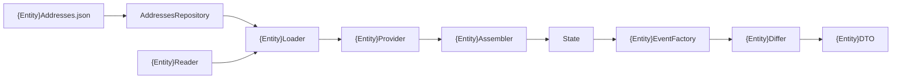

# Memory Entity — Backend

Full pipeline for a **new** `State` entity. Reference implementation:
**`CardBattle`** (smallest end-to-end entity). For nested lists, mirror
**`Npcs`**.

**Prerequisite:** addresses confirmed (`memory-compare`) and the user agreed a
new entity is warranted (not a field on an existing one). Confirm the entity
name (`{Entity}`, PascalCase) before starting.

## When NOT to use

| Case | Use instead |
|------|-------------|
| New field on Player / Party / DigimonBattle / … | `address-field-backend` |
| New quest or journal category | `quest-pattern-backend` |
| Frontend store / SignalR handler | `memory-entity-frontend` |

## Pipeline

## Checklist

Paths under `Backend/`. Mirror each `CardBattle*` file.

### 1. Memory layer

- [ ] `Memory/Definitions/{Entity}Addresses.json` (or a subfolder such as `Battles/`, `Parties/`)
- [ ] `Memory/Addresses/{Entity}Addresses.cs` — `long` props with `[JsonConverter(typeof(HexStringToLongConverter))]`
- [ ] `Memory/Repositories/IAddressesRepository.cs` + `AddressesRepository.cs` — cache field + `Get{Entity}Addresses() => LoadAndCache(ref cache, "{Entity}Addresses.json")`
- [ ] `Memory/Resources/{Entity}Resource.cs` — raw values, non-nullable, no domain rules
- [ ] `Memory/Readers/Interfaces/I{Entity}Reader.cs` + `Memory/Readers/{Entity}Reader.cs` — stateless, primary constructor `(IMemoryReader memoryReader)`

### 2. Application layer

- [ ] `Application/Loaders/Interfaces/I{Entity}Loader.cs` + `Application/Loaders/{Entity}Loader.cs` — `reader.Read(addressesRepository.Get{Entity}Addresses())`
- [ ] `Application/Providers/Interfaces/I{Entity}Provider.cs` + `Application/Providers/{Entity}Provider.cs` — `{Entity}Assembler.Assemble(loader.Load())`
- [ ] `Application/StateComposer.cs` — inject provider, set `{Entity} = provider.Get()`

### 3. Domain

- [ ] `Domain/Models/{Entity}.cs` — `record class`; override `Equals`/`GetHashCode` only if it holds collections
- [ ] `Domain/Models/State.cs` — `public {Entity} {Entity} { get; set; } = new();`
- [ ] `Domain/Assemblers/{Entity}Assembler.cs` — `static`; apply domain normalizations (sentinels → `null`, bytes → `bool`)
- [ ] If a new invariant exists, add it to `.cursor/rules/digivice-business.mdc`

### 4. Events

- [ ] `Events/DTO/{Entity}DTO.cs` — `record class : IDTO`; each prop `Optional<T>` with `[JsonIgnore(Condition = JsonIgnoreCondition.WhenWritingDefault)]` and `= Optional<T>.Empty`
- [ ] `Events/Converters/{Entity}Converter.cs` — `static ToDTO` (full)
- [ ] `Events/Diffing/{Entity}Differ.cs` — `HasNoChanges` → empty; previous null → full; else per-field delta
- [ ] `Events/Models/EventType.cs` — `{Entity}Changed`
- [ ] `Events/Factory/{Entity}EventFactory.cs` — `dto.IsNotEmpty()` → `new Event(EventType.{Entity}Changed, dto)`
- [ ] `Events/Factory/StateEventFactory.cs` — `events.AddRange({Entity}EventFactory.Create(...))`
- [ ] `Events/DTO/StateDTO.cs` + `Events/Converters/StateConverter.cs` — include the entity in `InitialState`

### 5. Wiring

- [ ] `Infrastructure/DependencyInjection.cs` — `AddSingleton` for reader, loader, provider (in their existing blocks)
- [ ] `Diagnostics/DebugConsoleRenderer.cs` — render the entity if other entities are rendered there

### 6. Tests

Conventions: skill `backend-tests`. One test file per production file, mirroring folders:

- [ ] `Tests/Unit/Memory/Readers/{Entity}ReaderTests.cs`
- [ ] `Tests/Unit/Domain/Assemblers/{Entity}AssemblerTests.cs`
- [ ] `Tests/Unit/Application/{Entity}ProviderTests.cs`
- [ ] `Tests/Unit/Events/Converters/{Entity}ConverterTests.cs`
- [ ] `Tests/Unit/Events/Diffing/{Entity}DifferTests.cs`
- [ ] `Tests/Unit/Events/Factory/{Entity}EventFactoryTests.cs`
- [ ] `Tests/Integration/Application/Loaders/{Entity}LoaderTests.cs` (real JSON via `LoaderIntegrationTestBase`)
- [ ] Update: `StateComposerTests`, `StateEventFactoryTests`, `StateConverterTests`, `AddressesRepositoryDefinitionsTests`, `DependencyInjectionTests`, `GameLoopServiceTests` (constructors/mocks)
- [ ] `dotnet test Tests/Tests.csproj -p:UseAppHost=false` (ask the user to stop the running Backend if the DLL is locked)

### 7. Docs

- [ ] Add the entity row to `address-field-backend` entity map
- [ ] Mark addresses as integrated in `memory-compare/memory-regions.md`

**Stop.** Hand off to `memory-entity-frontend`.
