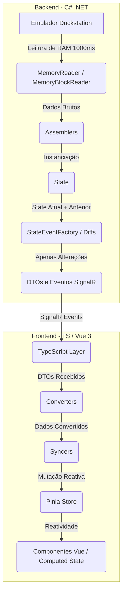

# Regras de Negócio e Arquitetura - Digivice

> [!NOTE]  
> Este documento serve como referência de contexto de alto nível para a IA. Ele descreve a arquitetura geral do Digivice (tracker de memória para *Digimon World 2003* rodando no emulador *Duckstation*) e define as regras invariantes do domínio.

---

## 1. Fluxo de Dados e Arquitetura do Sistema



### O Loop de Jogo (Game Loop)
*   **Frequência:** A cada `1000ms` (1 segundo), a classe `GameLoopService` executa um loop de varredura de memória (dentro de uma instrução `while`).
*   **Montagem do Estado:** Os leitores de memória extraem bytes brutos que são processados por classes `Assembler` para higienizar e estruturar os dados em entidades, culminando na criação de um objeto unificado chamado `State`.
*   **Cálculo de Diferenças (Diffs):** O `StateEventFactory` compara o `State` atual com o anterior através de mecanismos de *Diff*. Ele identifica quais propriedades específicas mudaram e encapsula apenas as alterações em DTOs.
*   **Despacho de Eventos:** Todos os eventos de mudança (ex: `PlayerChanged`, `PartyChanged`) são despachados simultaneamente através do `EventDispatcher` utilizando **SignalR**.

### Sincronização no Frontend
*   **Estado Inicial (`InitialState`):** No momento da conexão, um DTO completo do `State` é enviado ao frontend. Ele é convertido em modelo pela classe `StateConverter` e define o estado inicial da Pinia Store.
*   **Sincronização Incremental:** Eventos subsequentes trazem DTOs contendo apenas dados que foram alterados. Os `Syncers` mutam o estado reativo da store de forma cirúrgica.
*   **Regra de Ouro do Syncer:** Se um valor vier como `undefined` (não enviado/sem alteração), o frontend **não deve** realizar nenhuma ação.

---

## 2. Invariantes de Domínio e Regras do Jogo

### 2.1. O Grupo (Party)
*   **Capacidade Máxima:** No jogo, o jogador pode ter até 3 Digimons ativos em seu grupo.
*   **Estrutura de Slots:** O objeto `Party` possui uma lista que **sempre contém exatamente 3 slots** (`DigimonSlot`), independentemente de quantos estejam ocupados.
*   **Validação de Estado do Slot:**
    *   **Slot Ocupado:** Ambas as propriedades `digimonId` (ID numérico) e `digimon` (Entidade `Digimon`) **devem ter valor não-nulo** simultaneamente.
    *   **Slot Vazio:** Ambas as propriedades `digimonId` e `digimon` **devem ser nulas** simultaneamente.
    *   **Estado de Erro:** Ter uma propriedade nula e a outra preenchida é uma inconsistência crítica de dados.

```typescript
// Validação estrutural de um DigimonSlot reativo
if (slot.digimonId === null || slot.digimon === null) {
    // Slot está vazio e limpo
    slot.digimonId = null;
    slot.digimon = null;
} else {
    // Slot está ativo e ocupado
}
```

### 2.2. Digimon e Evoluções (Digievolutions)
*   **Evoluções Ativas:** Cada `Digimon` gerencia sua própria lista de evoluções através de `DigievolutionSlot`.
*   **Comportamento de Preenchimento:**
    *   Diferente da *Party*, uma vez que um slot de evolução é preenchido com dados, **ele nunca mais poderá ser esvaziado** (voltar a ser `null`).
    *   A evolução de um slot pode ser substituída/trocada por outra evolução, mas o slot nunca é resetado para vazio.

### 2.3. Diário de Missões (Journal)
*   **Origem dos Dados:** A estrutura das missões (passos, nomes, etc.) é estática e carregada a partir de arquivos JSON.
*   **Leitura de Memória:** O backend lê apenas as propriedades dinâmicas `Value` de cada `Step` e `Requisite`.
*   **Ciclo de Vida do Journal:**
    *   Todas as missões (principais e secundárias) e seus respectivos passos são enviados no `InitialState`.
    *   Missões **nunca são adicionadas ou removidas dinamicamente** do journal durante a execução da aplicação.
    *   Mesmo após uma missão ser finalizada, ela continua no diário. Não há flag de conclusão ("missão concluída") vinda do backend; o frontend calcula a conclusão analisando se todos os passos/requisitos estão satisfeitos.