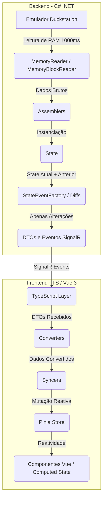

# Regras de Negócio e Arquitetura - Digivice

> [!NOTE]  
> Este documento serve como referência de contexto de alto nível para a IA. Ele descreve a arquitetura geral do Digivice (tracker de memória para *Digimon World 2003* rodando no emulador *Duckstation*) e define as regras invariantes do domínio.

---

## 1. Fluxo de Dados e Arquitetura do Sistema



### O Loop de Jogo (Game Loop)
*   **Frequência:** A cada `1000ms` (1 segundo), a classe `GameLoopService` executa um loop de varredura de memória (dentro de uma instrução `while`).
*   **Montagem do Estado:** Os leitores de memória extraem bytes brutos que são processados por classes `Assembler` para higienizar e estruturar os dados em entidades, culminando na criação de um objeto unificado chamado `State`.
*   **Cálculo de Diferenças (Diffs):** O `StateEventFactory` compara o `State` atual com o anterior através de mecanismos de *Diff*. Ele identifica quais propriedades específicas mudaram e encapsula apenas as alterações em DTOs.
*   **Despacho de Eventos:** Todos os eventos de mudança (ex: `PlayerChanged`, `PartyChanged`) são despachados simultaneamente através do `EventDispatcher` utilizando **SignalR**.

### Sincronização no Frontend
*   **Estado Inicial (`InitialState`):** No momento da conexão, um DTO completo do `State` é enviado ao frontend. Ele é convertido em modelo pela classe `StateConverter` e define o estado inicial da Pinia Store.
*   **Sincronização Incremental:** Eventos subsequentes trazem DTOs contendo apenas dados que foram alterados. Os `Syncers` mutam o estado reativo da store de forma cirúrgica.
*   **Regra de Ouro do Syncer:** Se um valor vier como `undefined` (não enviado/sem alteração), o frontend **não deve** realizar nenhuma ação.
*   **Consumo Direto por Componentes (Single Source of Truth):** Os componentes Vue (`App.vue`, `DigimonCard.vue`, etc.) importam e consomem os dados e propriedades computadas da `useGameStore` de forma direta e reativa. Não existem controladores intermediários ou camadas extras de tráfego de dados, garantindo simplicidade e sincronia em tempo real.

---

## 2. Invariantes de Domínio e Regras do Jogo

### 2.1. O Grupo (Party)
*   **Capacidade Máxima:** No jogo, o jogador pode ter até 3 Digimons ativos em seu grupo.
*   **Estrutura de Slots:** O objeto `Party` possui uma lista que **sempre contém exatamente 3 slots** (`DigimonSlot`), independentemente de quantos estejam ocupados.
*   **Mínimo de Slots Ocupados:** A lista de `DigimonSlot` **sempre contém pelo menos 1 slot preenchido**. Não é possível existir uma lista com todos os slots vazios.
*   **Validação de Estado do Slot:**
    *   **Slot Ocupado:** Ambas as propriedades `digimonId` (ID numérico) e `digimon` (Entidade `Digimon`) **devem ter valor não-nulo** simultaneamente.
    *   **Slot Vazio:** Ambas as propriedades `digimonId` e `digimon` **devem ser nulas** simultaneamente.
    *   **Estado de Erro:** Ter uma propriedade nula e a outra preenchida é uma inconsistência crítica de dados.

```typescript
// Validação estrutural de um DigimonSlot reativo
if (slot.digimonId === null || slot.digimon === null) {
    // Slot está vazio e limpo
    slot.digimonId = null;
    slot.digimon = null;
} else {
    // Slot está ativo e ocupado
}
```

*   **Identidade do Digimon vs. estado em runtime:** O `digimonId` (ID da espécie/entrada estática) pertence ao `DigimonSlot`, não ao modelo `Digimon`. O objeto `Digimon` carrega apenas estado dinâmico lido da memória (nível, EXP, vitals, equipamentos, etc.). Dados derivados de tabelas estáticas (nome, curva de EXP, digievoluções) são resolvidos no frontend usando `digimonId` + presenters/repositórios. Essa separação é intencional.
*   **Slots vazios na gameplay:** Um slot vazio (`digimonId` e `digimon` nulos) representa uma posição do grupo sem Digimon ativo no momento — por exemplo, o jogador explorando o mapa com apenas um Digimon na party. Os três slots **sempre** existem no estado (store/syncers/backend); a UI não precisa espelhar os três cartões quando só há Digimons ativos.
*   **Renderização na UI (`App.vue`):** O estado da party chega completo (3 slots). Na hora de desenhar, renderizar **apenas** slots ocupados (`digimonId` e `digimon` não nulos), pois isso reflete o que o jogador está vendo na gameplay no momento — não é omissão do modelo de 3 slots, é filtro de apresentação.

### 2.2. Digimon e Evoluções (Digievolutions)
*   **Evoluções Ativas:** Cada `Digimon` gerencia sua própria lista de evoluções através de `DigievolutionSlot`.
*   **Comportamento de Preenchimento:**
    *   Um slot de digievolução pode estar **vazio** (sem evolução ativa naquele índice) ou **preenchido** (`digievolutionId` e `digievolution` não nulos no frontend).
    *   Transições válidas: **vazio → preenchido** (primeira evolução naquele slot) e **preenchido (X) → preenchido (Y)** (troca de evolução no mesmo índice).
    *   **Proibido na gameplay:** **preenchido → vazio** — um slot que já recebeu uma digievolução **nunca** volta a ser esvaziado (`null`).
    *   Na UI, linha “empty” representa slots que **ainda nunca foram preenchidos** (ex.: `digievolutionId` inválido/vazio na leitura, tipicamente `0`), não um slot que “perdeu” uma evolução.
*   **Técnicas de digievolução (catálogo estático):**
    *   A lista de técnicas por `digievolutionId` vem de JSON estático (`digievolution-technique.json`).
    *   **Técnica assinatura (*signature*):** a técnica com maior `learnLevel` na lista daquela digievolução (última aprendida na curva do JSON).
    *   Nomes e descrições de **técnicas** usam i18n (`technique.{id}.name`, etc.) — são rótulos de habilidade, não nomes próprios.
    *   Nomes de **digievoluções** (e Digimons) continuam literais, sem i18n — ver regra de nomes próprios abaixo.
*   **Level Máximo do Digimon:** O nível máximo que um Digimon pode atingir é estritamente **99**.
    *   Como os dados lidos do emulador respeitam rigorosamente a estrutura de memória do jogo original, é uma invariante de domínio que o valor de nível estará sempre dentro do intervalo de `1` a `99`.
    *   Validações defensivas de higienização de nível (como operações `Math.min` ou `Math.max` para travar o nível entre 1 e 99 no frontend) são desnecessárias e redundantes para os cálculos de experiência.
*   **Blast gauge (Fúria):** Cada Digimon possui sua **própria** barra de Blast (0–1000). Não existe barra global compartilhada. Com 3 Digimons na party, cada um mantém seu valor individualmente — inclusive fora de batalha, quando o jogo não exibe a barra. Endereço em RAM: `0x00042B74 + (2 × rookieId)` (Int32 LE), onde `rookieId` é o `Id` em `DigimonsAddresses.json` (0–7).
*   **Tradução de Nomes de Digimons e Digievoluções:** Os nomes de Digimons e de suas Digievoluções são **nomes próprios** (assim como nomes de pessoas). Nomes próprios **não se traduzem** e, portanto, **nunca** devem passar por funções de localização ou internacionalização (como `getLocalized(...)`). Eles devem ser exibidos de forma literal exatamente como vêm das fontes de dados.

### 2.3. Diário de Missões (Journal)
*   **Origem dos Dados:** A estrutura das missões (passos, nomes, etc.) é estática e carregada a partir de arquivos JSON.
*   **Leitura de Memória:** O backend lê apenas as propriedades dinâmicas `Value` de cada `Step` e `Requisite`.
*   **Ciclo de Vida do Journal:**
    *   Todas as missões (principais e secundárias) e seus respectivos passos são enviados no `InitialState`.
    *   Missões **nunca são adicionadas ou removidas dinamicamente** do journal durante a execução da aplicação.
    *   Mesmo após uma missão ser finalizada, ela continua no diário. Não há flag de conclusão ("missão concluída") vinda do backend; o frontend calcula a conclusão analisando se todos os passos/requisitos estão satisfeitos.

---

## 3. Diretrizes de Estilo e Padronização (Frontend)
*   **Uso de Aspas em Strings:** No código do frontend, prefira sempre utilizar aspas duplas (`"`) em strings sempre que houver a opção (ao invés de aspas simples `'`), mantendo a padronização e consistência estética do código.