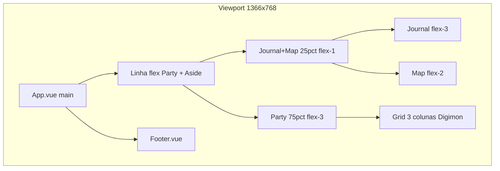

# Checklist de responsividade — 1366×768

> [!NOTE]
> Documento de referência para revisar o frontend aos poucos. Não é um roteiro de implementação fechado: use como lista de verificação e priorize o que mais incomoda na tela real.

---

## Contexto do app

- App **desktop** (Tauri), não mobile-first.
- `Frontend/src/style.css`: `html, body` com `overflow: hidden` — a janela **não pode** rolar; só painéis internos com `overflow-y-auto` + `custom-scroll`.
- Janela padrão hoje em `Frontend/src-tauri/tauri.conf.json`: 800×600 (resizable). Vale alinhar `minWidth`/`minHeight` a 1366×768 quando estiver satisfeito com o resultado.
- Fonte global: **Press Start 2P** — não escala bem; abaixo de ~9–10px a legibilidade cai rápido.

### Orçamento aproximado de pixels

| Consumo | Valor estimado |
|---------|----------------|
| Padding `main` (`p-4`) | 32px H + 32px V |
| Gaps (`gap-4` em vários níveis) | ~48–64px |
| Footer | ~55–70px |
| Área útil do bloco principal | ~1334×~620px |

**Pior caso de teste:** 1366×768 + **3 Digimons** na party + locale **pt-BR** (textos mais longos).

---

## Como validar cada mudança

Antes de começar, fixe este ritual de teste (DevTools ou janela Tauri redimensionada):

1. **1366×768** — tela principal, 1 Digimon na party
2. **1366×768** — tela principal, **3 Digimons** na party
3. Abrir cada modal principal (Quest, Digievoluções grid, Enemy, Auction, Techniques)
4. Hover em tooltips nas bordas (Stats, Equipments, Footer)
5. Confirmar: **sem scroll na janela**; scroll só dentro de painéis

---

## Prioridade sugerida (ordem de ataque)

Trabalhe de fora para dentro: shell → footer → party cards → detalhes internos → modais.

| Prioridade | Área | Por quê |
|------------|------|---------|
| P0 | Shell `Frontend/src/App.vue` | Define proporções e altura de tudo |
| P0 | Footer `Frontend/src/components/footer/Footer.vue` | Overlap provável com bloco `absolute` |
| P1 | Party + Digimon card | Grid 3 colunas + conteúdo vertical denso |
| P1 | Stats, Equipments, Profile | Valores fixos e gaps grandes |
| P2 | Journal / Map (coluna estreita) | ~25% da largura em 1366 |
| P2 | Modais pesados | Já usam `vh`/`vw` em parte |
| P3 | Tooltips, cards do journal, polish | Ajustes finos |

---

## P0 — Shell e fundação

### `Frontend/src/App.vue`

- [ ] Revisar proporção **`flex-3` (Party) vs `flex-1` (Aside)** — em 1366 a coluna direita fica ~330px; Journal + Map ficam apertados.
- [ ] Avaliar **`min-w-75`** na coluna Aside — pode forçar overflow horizontal.
- [ ] Avaliar **`min-h-150`** na linha principal — pode empurrar conteúdo além de 768px de altura.
- [ ] Avaliar **`min-h-50`** na área do Map — idem.
- [ ] Reduzir **`p-4`** e **`gap-4`** só no breakpoint mínimo? (ganho rápido de pixels)
- [ ] Confirmar cadeia flex com **`min-h-0`** em todos os elos até áreas que devem rolar:
  - `main` → linha flex → `Party` / coluna Aside → `dw3-aside` → área `overflow-y-auto`
- [ ] Decidir política de scroll nos **cards Digimon**: o card inteiro rola por dentro, ou só partes internas?

### `Frontend/src/style.css`

- [ ] Manter `overflow: hidden` no body até ter certeza de que painéis internos absorvem o excesso.
- [ ] Se criar utilitários de compactação (ex. `dw3-compact`), centralizar aqui em vez de espalhar magic numbers.
- [ ] Considerar breakpoint único no CSS (ex. `@media (max-width: 1366px)`) ou tokens no `@theme` do Tailwind v4 para paddings/gaps compactos.

### `Frontend/src-tauri/tauri.conf.json`

- [ ] Quando estável: definir `minWidth: 1366`, `minHeight: 768` (ou o piso real que escolher).
- [ ] Testar se chrome da janela Tauri consome pixels além do viewport do WebView.

---

## P0 — Footer

### `Frontend/src/components/footer/Footer.vue`

- [ ] **`gap-12`** entre 4 blocos de stats — provável overflow horizontal.
- [ ] Bloco **`absolute right-4`** (idioma + conexão) pode **sobrepor** stats do meio em larguras menores.
- [ ] Labels com **`text-[0.7rem]`** + valores **`text-lg`** — ocupam muita largura; considerar:
  - esconder labels e manter só valores + tooltip
  - `flex-wrap` ou grid 2 linhas
  - reduzir `gap` e `px-6`
- [ ] Nome do tamer longo — precisa de **`truncate`** ou `max-w-*`?
- [ ] Testar com pt-BR: "Carisma do grupo", "Nível do grupo", etc.

### `Frontend/src/components/footer/LanguageSelector.vue`

- [ ] Verificar se `ring-offset` das bandeiras não aumenta área clicável além do necessário no footer compacto.

---

## P1 — Party e card do Digimon

### `Frontend/src/components/party/Party.vue`

- [ ] **`grid grid-cols-3 gap-4`** com 3 Digimons → ~300px por card; validar se é viável.
- [ ] Alternativas a considerar (só se necessário): `gap-2`, colunas com `min-w-0`, ou menos colunas visíveis (decisão de produto).
- [ ] Garantir que o container da party tenha **`min-h-0`** e altura limitada pelo pai flex.

### `Frontend/src/components/party/digimon/Digimon.vue`

- [ ] **`p-4`** + **`gap-4`** no card — candidatos a compactação.
- [ ] Stack vertical: Profile → Digievoluções (5 linhas) → Stats → Equipments (5 linhas) → botão — muito alto para ~620px úteis divididos por 3 colunas.
- [ ] Definir se o card usa **`overflow-y-auto custom-scroll`** ou se subcomponentes comprimem.

### `Frontend/src/components/party/digimon/profile/Profile.vue`

- [ ] Ícone **`w-16 h-16`** fixo — testar `w-12 h-12` no breakpoint mínimo.
- [ ] **`p-3`** no painel — reduzir?
- [ ] Nome do Digimon já tem `truncate` — ok; validar com nomes longos.
- [ ] 4 `ProgressBar` empilhadas — altura mínima de cada uma.

### `Frontend/src/components/party/digimon/profile/ProgressBar.vue`

- [ ] Texto **`text-[0.6rem]`** — já no limite; evitar reduzir mais.
- [ ] Altura da barra em si.

### `Frontend/src/components/party/digimon/digievolutions/Digievolutions.vue` + `Digievolution.vue`

- [ ] 5 linhas com **`min-h-9`** cada + segmentos DVXP — soma altura considerável.
- [ ] **`text-sm tracking-wider`** — `tracking` come espaço horizontal; testar `tracking-wide` ou normal no mínimo.
- [ ] Coluna de nível **`w-11.25 shrink-0`** — necessária, mas verificar em card estreito.
- [ ] `truncate` no nome da digievolução — ok; validar nomes longos.

### `Frontend/src/components/party/digimon/stats/Stats.vue` — **alta prioridade**

- [ ] **`gap-20 -ml-16`** — provável primeiro ponto de quebra horizontal; revisar com urgência.
- [ ] Colunas fixas **`w-24`** para atributos e resistências.
- [ ] Padding **`p-4`** no painel.

### `Frontend/src/components/party/digimon/stats/Stat.vue`

- [ ] Ícone + valor na mesma linha — espaço em coluna estreita.

### `Frontend/src/components/party/digimon/equipments/Equipments.vue` + `Equipment.vue`

- [ ] Label do slot: **`min-w-18.75`** + **`tracking-widest`** — não encolhe; nomes de equipamento competem pelo espaço.
- [ ] Nome do equipamento já tem `truncate` — validar com i18n pt-BR (nomes longos).
- [ ] 5 linhas de equipamento — altura total do painel.

---

## P2 — Coluna direita (Journal + Map)

### `Frontend/src/components/journal/Journal.vue`

- [ ] Aside já usa `flex-1 min-h-0` + scroll interno — bom padrão; confirmar que funciona com coluna estreita.
- [ ] Título `dw3-aside-title` com `font-size: 0.875rem` em `style.css` — ok em coluna fina?

### `Frontend/src/components/journal/JournalQuestCard.vue`

- [ ] Títulos `text-xs` / `text-[10px]` — legíveis na coluna estreita?
- [ ] `line-clamp-1` na descrição — ok; testar títulos de quest longos.

### `Frontend/src/components/map/Map.vue` + `Location.vue`

- [ ] Map recebe **`flex-2`** vs Journal **`flex-3`** — em 1366 a área do mapa fica bem baixa (~150–180px).
- [ ] `Location` usa **`flex-3`** internamente — imagem do mapa ainda legível?
- [ ] Label da localização: `text-xs sm:text-sm` — um dos poucos breakpoints existentes; replicar padrão onde fizer sentido.

### `Frontend/src/components/map/Enemies.vue`

- [ ] Lista de inimigos em espaço vertical mínimo — overflow ou scroll local?

---

## P2 — Modais

### `Frontend/src/components/modal/Modal.vue`

- [ ] Base sólida: `p-4`, `max-h` configurável, `min-h-0` no corpo — usar como referência.
- [ ] Em 1366×768, `92vh` ≈ 706px — ainda cabe header + footer do modal?

### `Frontend/src/components/journal/quest-modal/QuestModal.vue`

- [ ] Já usa **`lg:flex-row`** — abaixo de `lg` empilha colunas (bom para altura).
- [ ] Em 1366, `lg` (1024px) **ativa** layout lado a lado dentro do modal — testar se cabe.
- [ ] `max-w-450` + `w-[98vw]` — largura ok; altura `h-[92vh] max-h-250` — validar.

### `Frontend/src/components/journal/quest-modal/StepPanel.vue`

- [ ] **`min-h-100`** nos estados vazio/erro — pode forçar altura excessiva.
- [ ] Mapa zoom (`ZoomedLocationMap.vue`) dentro do painel — testar interação em área pequena.

### `Frontend/src/components/party/digimon/digievolutions-modal/DigievolutionsModal.vue`

- [ ] Split fixo **`w-[75%]` / `w-[25%]`** — painel direito muito estreito em modal largo.
- [ ] Header com **`gap-6`** + SearchBar — compactar?
- [ ] Árvore de digievolução: scroll horizontal em `style.css` (`.family-row { overflow-x: auto }`) — ok, mas testar usabilidade.

### `Frontend/src/components/map/enemy-modal/EnemyModal.vue`

- [ ] `sm:flex-row` no corpo — testar perfil + stats lado a lado em 1366.
- [ ] `max-h-[70vh]` com scroll — ok.

### `Frontend/src/components/journal/auction-modal/AuctionModal.vue`

- [ ] Lista de leilões com textos `text-[10px]` — legível no modal menor?

### Modais menores (técnicas, digievolução inline)

- [ ] `Digievolutions.vue`: `max-w-lg`, `max-h-[75vh]`
- [ ] `DigievolutionTechniques.vue`: título `text-lg sm:text-xl`

---

## P3 — Tooltips e polish

### Padrão (ver `AI/CODE_RULES.md` seção Tooltips)

- [ ] `Frontend/src/composables/use-tooltip-position.ts` — flip nas bordas já existe; testar em 1366 com `maxWidth` 300–350.
- [ ] `StatsTooltip.vue` / `EquipmentsTooltip.vue`: **`min-w-42.5`** — cabe perto das bordas?
- [ ] Footer tooltips com `placement: "above"` — não cortar no topo da janela.

### Tipografia e i18n

- [ ] Evitar reduzir Press Start 2P abaixo de ~9–10px.
- [ ] Preferir: menos `tracking-widest`, mais `truncate`/`line-clamp`, `min-w-0` em flex.
- [ ] Testar strings pt-BR vs en-US nos pontos mais largos (footer, equipamentos, quest titles).

### Breakpoints — estratégia

- [ ] Hoje poucos `sm:`/`lg:` espalhados — evitar dezenas de media queries.
- [ ] Opção A: breakpoint único `@media (max-width: 1366px)` com overrides no shell + componentes críticos.
- [ ] Opção B: container queries no card Digimon (Tailwind v4 suporta) para compactar só quando o card fica estreito.
- [ ] Não tratar como mobile: **sem stack vertical completo** da tela principal, salvo decisão explícita.

---

## O que evitar

- Remover `overflow: hidden` do body sem plano — mascara overflow em vez de resolver.
- Encolher fonte pixel além do legível.
- Duplicar blocos longos de Tailwind — extrair para `style.css` / classes `dw3-*` (já é regra do projeto).
- Refatorar todos os componentes de uma vez — incremental por prioridade.
- Adicionar testes automatizados de frontend (regra do projeto).

---

## Checklist final de “pronto para 1366×768”

- [ ] Tela principal: sem scroll na janela; scroll só em painéis internos
- [ ] 3 Digimons: cards legíveis, sem corte horizontal
- [ ] Footer: sem overlap entre stats e idioma/conexão
- [ ] Journal: scrollável e cards clicáveis na coluna estreita
- [ ] Map: localização e inimigos ainda utilizáveis
- [ ] Modais principais abertos: cabem sem cortar header/fechar
- [ ] Tooltips: não saem da tela nas bordas
- [ ] pt-BR: sem truncamento excessivo em pontos críticos (ou truncamento aceitável com tooltip)
- [ ] Tauri: `minWidth`/`minHeight` alinhados ao piso suportado
