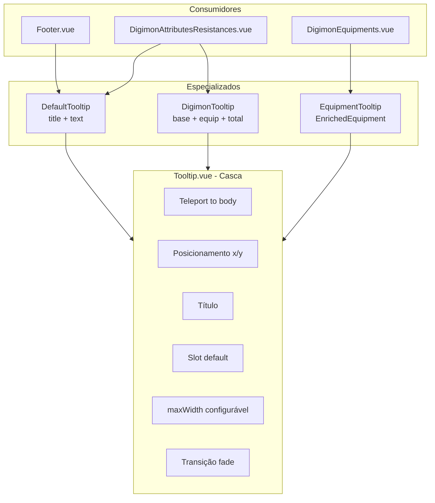

# Plano de Refatoração — Tooltips

> **Status:** aguardando revisão e aprovação  
> **Escopo:** unificar tooltips do frontend em uma arquitetura em camadas, eliminando duplicação de estilo, posicionamento e lógica de exibição.

---

## 1. Situação atual

### 1.1. Componentes existentes

| Arquivo | Localização | Padrão de uso | Conteúdo |
|---------|-------------|---------------|----------|
| `MouseTooltip.vue` | `components/tooltip/` | **Imperativo** (`ref` + `defineExpose`: `show`, `hide`, `move`) | Título + texto simples |
| `DigimonTooltip.vue` | `components/digimon/` | **Declarativo** (`activeTooltip` object) | Dois modos via `isMath`: texto explicativo **ou** breakdown matemático |
| `DigimonEquipmentTooltip.vue` | `components/digimon/` | **Declarativo** (`activeTooltip` object) | Nome, tipo, atributos, equipável por, nota |

### 1.2. Consumidores

| Consumidor | Tooltip usado | Interação |
|------------|---------------|-----------|
| `Footer.vue` | `MouseTooltip` | Hover no group charisma → `tooltipRef.show(e, title, text)` |
| `DigimonAttributesResistances.vue` | `DigimonTooltip` | Hover no ícone → explicação (`isMath: false`); hover no valor → cálculo (`isMath: true`) |
| `DigimonEquipments.vue` | `DigimonEquipmentTooltip` | Hover no slot de equipamento |

### 1.3. Problemas identificados

1. **Estilo duplicado** — os três componentes repetem a mesma casca visual (`Teleport`, backdrop, borda azul, `z-[9999]`, transição `fade`, etc.).
2. **Posicionamento duplicado** — a lógica de `clientX + 15`, flip horizontal quando próximo da borda e largura fixa de `250px` está copiada em `MouseTooltip`, `DigimonAttributesResistances` e `DigimonEquipments`.
3. **`DigimonTooltip` com responsabilidade dupla** — o flag `isMath` mistura dois tipos de conteúdo distintos no mesmo componente.
4. **Títulos cortados** — `max-w-[250px]` fixo não comporta títulos longos (ex.: nomes de equipamento, labels traduzidos).
5. **Organização de pastas** — tooltips de digimon/equipamento vivem em `components/digimon/` em vez de uma pasta dedicada.

---

## 2. Objetivo

Criar uma hierarquia de tooltips em camadas:

```
Tooltip.vue              ← casca genérica (posição, estilo, título, slot)
├── DefaultTooltip.vue   ← título + texto
├── DigimonTooltip.vue   ← breakdown matemático de atributos/resistências
└── EquipmentTooltip.vue ← detalhes de equipamento
```

---

## 3. Arquitetura proposta

### 3.1. Estrutura de arquivos (resultado final)

```
Frontend/src/
├── composables/
│   └── use-tooltip-position.ts      ← NOVO: lógica de posicionamento reutilizável
└── components/tooltip/
    ├── Tooltip.vue                  ← renomeado/refatorado a partir de MouseTooltip
    ├── DefaultTooltip.vue           ← NOVO
    ├── DigimonTooltip.vue           ← movido e simplificado (só modo math)
    └── EquipmentTooltip.vue         ← renomeado a partir de DigimonEquipmentTooltip
```

**Arquivos removidos após migração:**
- `components/tooltip/MouseTooltip.vue`
- `components/digimon/DigimonTooltip.vue`
- `components/digimon/DigimonEquipmentTooltip.vue`
- `components/ui/MouseTooltip.vue` (se existir — aparenta ser resíduo não referenciado)

### 3.2. Diagrama de responsabilidades



---

## 4. API de cada componente

### 4.1. `Tooltip.vue` (base genérica)

**Responsabilidade:** apenas a casca — posição, visibilidade, estilo e estrutura (título + corpo).

**Props:**

| Prop | Tipo | Default | Descrição |
|------|------|---------|-----------|
| `show` | `boolean` | `false` | Controla visibilidade |
| `x` | `number` | `0` | Posição horizontal (`px`) |
| `y` | `number` | `0` | Posição vertical (`px`) |
| `title` | `string` | `''` | Texto do cabeçalho |
| `maxWidth` | `number` | `250` | Largura máxima em pixels |

**Slots:**

| Slot | Descrição |
|------|-----------|
| `default` | Corpo do tooltip (conteúdo personalizado) |
| `title` *(opcional)* | Substitui a renderização padrão do título, caso algum tooltip precise de formatação especial no header |

**Comportamento visual (herdado do estilo atual):**
- `fixed z-[9999] pointer-events-none`
- Fundo `#001133ee`, borda `#0066cc`, backdrop blur
- Título: amarelo, uppercase, borda inferior
- Transição `fade`
- `max-width` aplicado via `:style` ou classe dinâmica a partir de `maxWidth`

**O que NÃO faz:**
- Não calcula posição (recebe `x`/`y` prontos)
- Não escuta eventos de mouse
- Não contém lógica de negócio

---

### 4.2. `useTooltipPosition` (composable)

**Responsabilidade:** centralizar a lógica de posicionamento hoje duplicada.

**Estado retornado:**

```typescript
{
  show: Ref<boolean>;
  x: Ref<number>;
  y: Ref<number>;
  maxWidth: Ref<number>;

  showAt(event: MouseEvent, maxWidth?: number): void;
  hide(): void;
  move(event: MouseEvent): void;
}
```

**Regras de posicionamento (mantidas do comportamento atual):**
- Offset padrão: `clientX + 15`, `clientY + 15` (ou `- 15` no eixo Y para o `MouseTooltip` do Footer que usa `translateY(-100%)` — ver ponto aberto na seção 7)
- Flip horizontal quando `posX + maxWidth > window.innerWidth`
- `maxWidth` configurável por chamada

---

### 4.3. `DefaultTooltip.vue`

**Responsabilidade:** tooltip simples com título + parágrafo de texto.

**Props:**

| Prop | Tipo | Default | Descrição |
|------|------|---------|-----------|
| `show` | `boolean` | — | Visibilidade |
| `x` | `number` | — | Posição X |
| `y` | `number` | — | Posição Y |
| `title` | `string` | — | Cabeçalho |
| `text` | `string` | — | Corpo textual |
| `maxWidth` | `number` | `250` | Largura máxima |

**Implementação:** compõe `Tooltip.vue` e renderiza o `text` no slot default com o estilo de parágrafo existente (`text-gray-100 text-xs`).

**Uso previsto:**
- `Footer.vue` — group charisma warning
- `DigimonAttributesResistances.vue` — explicação ao hover no ícone de atributo/resistência (hoje `isMath: false` no `DigimonTooltip`)

**API imperativa (opcional via `defineExpose`):**

Para minimizar mudanças no `Footer.vue`, o `DefaultTooltip` pode expor `show(event, title, text)`, `hide()` e `move(event)` internamente usando o composable. Isso mantém a ergonomia atual do Footer sem espalhar estado reativo no template.

---

### 4.4. `DigimonTooltip.vue`

**Responsabilidade:** exibir o breakdown matemático de um atributo/resistência.

**Props:**

| Prop | Tipo | Descrição |
|------|------|-----------|
| `show` | `boolean` | Visibilidade |
| `x` | `number` | Posição X |
| `y` | `number` | Posição Y |
| `title` | `string` | Nome do atributo/resistência |
| `base` | `number` | Valor base do Digimon (`fromDigimon`) |
| `equip` | `number` | Bônus de equipamentos |
| `total` | `number` | Soma exibida (base + equip) |
| `maxWidth` | `number` | Default `250` |

**Implementação:** compõe `Tooltip.vue` com o layout do bloco `isMath: true` atual (total centralizado, labels "Base Digimon" / "Equipments").

**Nota:** a prop `digi` (`fromDigievolution`) existe no estado atual mas **não é renderizada** no tooltip math — o valor de digievolution aparece inline ao lado do número na linha do atributo. Manter esse comportamento; não incluir `digi` nas props do novo componente, a menos que você queira exibir no tooltip futuramente.

---

### 4.5. `EquipmentTooltip.vue`

**Responsabilidade:** exibir detalhes de um `EnrichedEquipment`.

**Props:**

| Prop | Tipo | Descrição |
|------|------|-----------|
| `show` | `boolean` | Visibilidade |
| `x` | `number` | Posição X |
| `y` | `number` | Posição Y |
| `equipment` | `EnrichedEquipment \| null` | Item a exibir |
| `maxWidth` | `number` | Default **`300`** (maior que o padrão — nomes de equipamento tendem a ser longos) |

**Implementação:** migração direta do conteúdo de `DigimonEquipmentTooltip.vue` para dentro de `Tooltip.vue`. O título passa a ser o nome localizado do equipamento via prop `title` no `Tooltip`, ou via slot `title` se preferir centralizar a localização no wrapper.

---

## 5. Migração dos consumidores

### 5.1. `Footer.vue`

**Antes:**
```vue
<MouseTooltip ref="tooltipRef" />
<!-- @mouseenter="e => tooltipRef?.show(e, title, text)" -->
```

**Depois (opção recomendada — mínima alteração):**
```vue
<DefaultTooltip ref="tooltipRef" />
<!-- mesmos event handlers, mesma API imperativa exposta -->
```

Alternativa declarativa (mais verbosa no Footer, não recomendada neste caso):
```vue
<DefaultTooltip :show="..." :x="..." :y="..." :title="..." :text="..." />
```

### 5.2. `DigimonAttributesResistances.vue`

**Antes:** um único `activeTooltip` com flag `isMath` + um `DigimonTooltip`.

**Depois:** dois tooltips especializados, compartilhando posição via composable:

```vue
<script setup>
const tooltipPosition = useTooltipPosition();

const defaultTooltipContent = ref({ title: '', text: '' });
const mathTooltipContent = ref({ title: '', base: 0, equip: 0, total: 0 });
const activeVariant = ref<'none' | 'default' | 'math'>('none');
</script>

<template>
  <!-- ... -->
  <DefaultTooltip
    :show="activeVariant === 'default'"
    :x="tooltipPosition.x"
    :y="tooltipPosition.y"
    v-bind="defaultTooltipContent"
  />
  <DigimonTooltip
    :show="activeVariant === 'math'"
    :x="tooltipPosition.x"
    :y="tooltipPosition.y"
    v-bind="mathTooltipContent"
  />
</template>
```

Handlers `showAttributeIconTooltip` / `showResistanceIconTooltip` passam a setar `activeVariant = 'default'`.  
Handler `showMathTooltip` passa a setar `activeVariant = 'math'`.  
`hideTooltip` → `activeVariant = 'none'`.  
`moveTooltip` → delega ao composable.

**Benefício:** elimina o objeto monolítico com campos irrelevantes (`base: 0` quando `isMath: false`, etc.).

### 5.3. `DigimonEquipments.vue`

**Antes:**
```vue
<DigimonEquipmentTooltip :activeTooltip="activeTooltip" />
```

**Depois:**
```vue
<EquipmentTooltip
  :show="tooltipPosition.show"
  :x="tooltipPosition.x"
  :y="tooltipPosition.y"
  :equipment="selectedEquipment"
  :max-width="300"
/>
```

Estado simplificado: `selectedEquipment` + composable de posição, sem wrapper object `{ show, item, x, y }`.

---

## 6. Plano de implementação (ordem sugerida)

### Fase 1 — Fundação
1. Criar `composables/use-tooltip-position.ts`
2. Criar `components/tooltip/Tooltip.vue` (casca genérica com props `show`, `x`, `y`, `title`, `maxWidth` + slot default)
3. Migrar estilos compartilhados (`fade` transition, `text-shadow-sm`) para `Tooltip.vue`

### Fase 2 — Especializados
4. Criar `DefaultTooltip.vue` compondo `Tooltip.vue`
5. Criar novo `DigimonTooltip.vue` em `components/tooltip/` (apenas modo math)
6. Criar `EquipmentTooltip.vue` compondo `Tooltip.vue` (conteúdo migrado de `DigimonEquipmentTooltip`)

### Fase 3 — Consumidores
7. Atualizar `Footer.vue` → `DefaultTooltip`
8. Atualizar `DigimonAttributesResistances.vue` → `DefaultTooltip` + `DigimonTooltip` + composable
9. Atualizar `DigimonEquipments.vue` → `EquipmentTooltip` + composable

### Fase 4 — Limpeza
10. Remover arquivos antigos (`MouseTooltip.vue`, `DigimonTooltip.vue` em digimon/, `DigimonEquipmentTooltip.vue`)
11. Verificar imports residuais e build

### Fase 5 — Validação manual
12. Hover no group charisma (Footer) — título + texto completo, sem corte
13. Hover no ícone de atributo/resistência — explicação via `DefaultTooltip`
14. Hover no valor numérico — breakdown via `DigimonTooltip`
15. Hover em equipamento — detalhes via `EquipmentTooltip`, nomes longos legíveis
16. Tooltip próximo à borda direita da tela — flip horizontal funcional
17. Tooltip desaparece ao sair do hover (`mouseleave`)

---

## 7. Pontos em aberto para sua revisão

### 7.1. Offset vertical do Footer

O `MouseTooltip` atual aplica `transform: translateY(-100%)` no tooltip do Footer, fazendo-o aparecer **acima** do cursor. Os tooltips de digimon/equipamento aparecem **abaixo** (`clientY + 15`).

**Opções:**
- **A)** Adicionar prop `placement: 'above' | 'below'` no `Tooltip.vue` (recomendado — flexível e explícito)
- **B)** Manter offset diferente apenas no `DefaultTooltip` do Footer via prop `yOffset`
- **C)** Padronizar todos para aparecer abaixo do cursor (mudança visual no Footer)

### 7.2. `maxWidth` — apenas prop numérica ou também presets?

**Opções:**
- **A)** Apenas `maxWidth: number` (simples, atende o pedido)
- **B)** Prop `size: 'sm' | 'md' | 'lg'` mapeando para `200 | 250 | 300` + override via `maxWidth`

Recomendação: **A** por simplicidade; defaults diferentes por especializado (`DefaultTooltip: 250`, `EquipmentTooltip: 300`).

### 7.3. Slot `title` no `Tooltip.vue`

Incluir slot `title` opcional desde o início, ou só adicionar quando surgir necessidade real?

Recomendação: incluir desde o início — custo baixo, evita prop drilling de formatação no `EquipmentTooltip`.

### 7.4. API imperativa no `DefaultTooltip`

Manter `defineExpose({ show, hide, move })` no `DefaultTooltip` para o Footer, ou migrar Footer para padrão declarativo?

Recomendação: **manter expose no `DefaultTooltip`** — Footer é o único consumidor imperativo e a API atual funciona bem.

### 7.5. `DigimonAttributeResistance.vue`

Os eventos `@showIconTooltip`, `@showMathTooltip`, `@moveTooltip`, `@hideTooltip` permanecem inalterados — a refatoração fica contida no pai (`DigimonAttributesResistances.vue`). Confirmar se concorda.

---

## 8. O que fica fora do escopo

- Refatoração de modais (`QuestDetailsModal`, etc.)
- Tooltip de digievolution (`DigievolutionDetailPanel.vue` tem Teleport próprio — outro padrão, não incluído)
- Testes automatizados (não existem hoje para tooltips; podem ser adicionados depois se desejado)
- Store Pinia para tooltips globais

---

## 9. Riscos e mitigação

| Risco | Mitigação |
|-------|-----------|
| Regressão visual (posição/tamanho) | Checklist manual da Fase 5 |
| Título ainda cortado em casos extremos | `maxWidth` configurável; `EquipmentTooltip` com default maior |
| Dois tooltips no mesmo pai (`DigimonAttributesResistances`) | `activeVariant` garante que só um fica visível |
| Footer quebrar com mudança de API | Manter `defineExpose` compatível no `DefaultTooltip` |

---

## 10. Estimativa de impacto

| Tipo | Quantidade |
|------|------------|
| Arquivos novos | 4 (`Tooltip`, `DefaultTooltip`, `DigimonTooltip`, `EquipmentTooltip`) + 1 composable |
| Arquivos removidos | 3 |
| Arquivos alterados | 3 consumidores (`Footer`, `DigimonAttributesResistances`, `DigimonEquipments`) |
| Componentes filhos inalterados | `DigimonAttributeResistance`, `DigimonEquipament` |

---

## 11. Decisões aguardando aprovação

Marque ou comente suas preferências:

- [ SIM] **Aprovar arquitetura em camadas** (`Tooltip` → especializados)
- [ A ] **Offset vertical:** opção A (prop `placement`) / B / C — qual?
- [ A ] **`maxWidth`:** opção A (numérica) / B (presets) — qual?
- [ S ] **Incluir slot `title`** no `Tooltip.vue`? Sim / Não 
Resposta: Eu estava pensando em title mais como uma prop. Porque pelo menos para a nossa necessidade atual, todos obrigatoriamente tem title.
- [ ? ] **Manter API imperativa** no `DefaultTooltip` para o Footer? Sim / Não
Resposta: Eu nem sei o que é isso sinceramente. Se você puder me explicar antes de seguir o plano eu agradeço.
- [ SIM ] **Default `maxWidth` do `EquipmentTooltip`:** 300px está ok?
- [ SIM ] Algum outro local do app que deveria usar `DefaultTooltip` agora ou no futuro?
Na hora de exibir a explicação dos Atributes/Resistências provavelmente usaremos o DefaultTooltip também, já que a estrutura é a mesma que temos no Footer (titulo e texto)

---

*Após aprovação deste plano, a implementação será feita fase a fase conforme a seção 6.*
